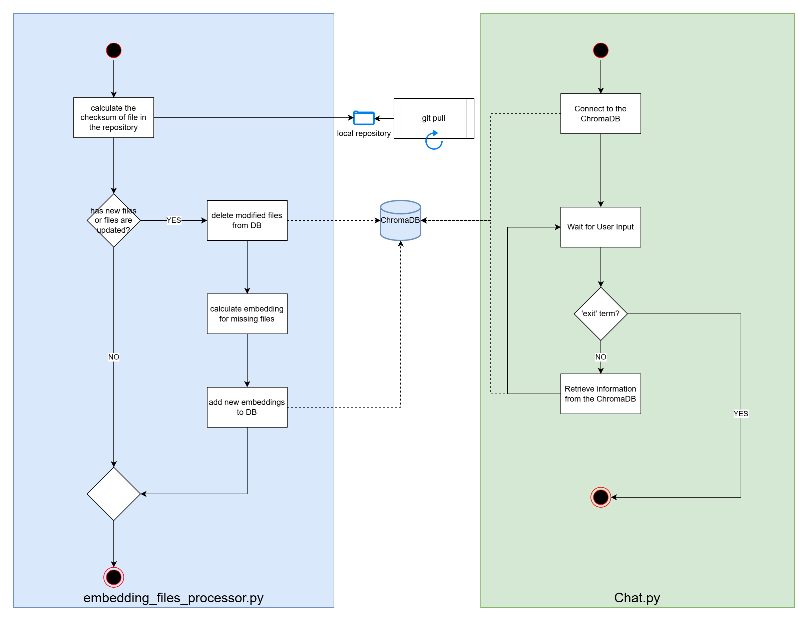

How Embeddings are updated?
----

When embeddings calculated and stored to the ChromaDB, we will pass extra information like 'checksum' to the metadata field. 
This information will be used for a later analysis of the repository on updates to the files. 

We will collect a list of files in the repository and their calculated checksum. The we will retrieve information from the ChromaDB for files and it's checksum to compare. Files, which checksum is different from freshly calculated, will be removed from the ChromaDB. Files, which checksum is equal to freshly calculated, will be removed from the list to process. 

The next step will be to do the embedding calculation for the remaining files in the original list and store the to ChromaDB.

** The update of the `local repository` is outside of the project. It should be done either manually, or by cron job on the machine where project is running.